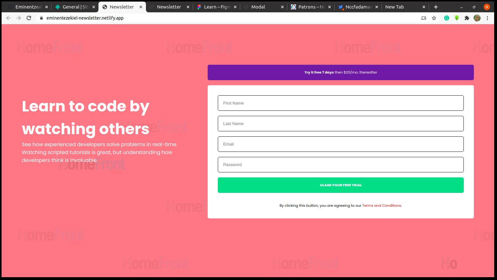

# Newsletter

## About the project
This is about creating a newsletter for subscribing to learning how to code.

## Image

## Built With
* CSS
* HTML

## Author
* 👨‍🦱Ezekiel Ogunniwa
  * Github: https://github.com/Eminentzeal
  * linkedin: https://www.linkedin.com/in/ogunniwaezekiel/
  * Twitter: https://twitter.com/Ogunniwaezekiel
* 👩Esther Davies
  * Github: https://github.com/Esther94
  * Twitter: @Esther62849599

## Facilitators
* [Godwin Nwachukwu](https://github.com/Gnwin).

* [Chioma Nwachukwu](https://github.com/Chiomy).

## Acknowledgements
* [HomeFrontStartup](http://homefrontstartup.com.ng)
* [Mentors International](https://mentorsint.com/)
  * https://www.facebook.com/mentorshubyola/
  * https://twitter.com/hub_mic
  * https://www.linkedin.com/company/michub/

## Live Demo
[Click Here to see project live](https://eminentezekiel-newsletter.netlify.app/)

## 🤝 Contributions
* This project is open to your comments and contributions, kindly reach the author through the above author's social media handles.

